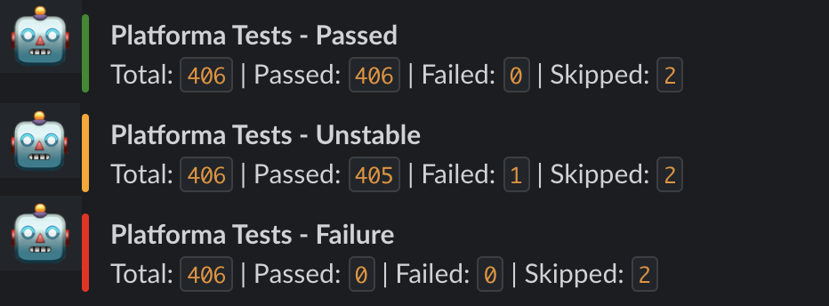

# slack-notify-junitxml-action
Github actions to notify the test result from junitxml file to any slack channel

## What does this github action do ?
Be it any type of tests - unit/integration/api in any language - java/python, you can generate **[JUNITXML](https://llg.cubic.org/docs/junit/)** easily as all languages provid this out of box. <br>
For example you are using pytest (python), then you can generate junitxml report like this: <br>
  pytest < test > --junitxml=< reportname >
  
## Slack Message examples


  
## Usage

```
name: Notify in Slack Channels
on: workflow_dispatch
jobs:
  notify-slack:
    runs-on: ubuntu-latest
    name: A job to notify in slack with my github actions
    environment: Slackbot Notification
    steps:
      - uses: actions/checkout@v2
      - name: Notify Slack Test Result
        uses: sanjaykrishnanrs/slack-notify-junitxml-action@0.1.12-alpha
        with:
          title: API Tests
          slackbotid: ${{ secrets.SLACKBOTID }}
          slackbottoken: ${{ secrets.SLACKBOTTOKEN }}
          slackchannel: '${{ secrets.SLACKCHANNEL }}'
          junitxml_filepath: junitreport.xml
```

# Pre-requisite
A slackbot configured in slack and added as an app to the channel where the message has to be sent. <br>
Read more - https://slack.com/intl/en-in/help/articles/115005265703-Create-a-bot-for-your-workspace
# License

The scripts and documentation in this project are released under the [MIT License](LICENSE)

# Contributions

Contributions are welcome! Create a branch or Fork the repo - Start doing !
